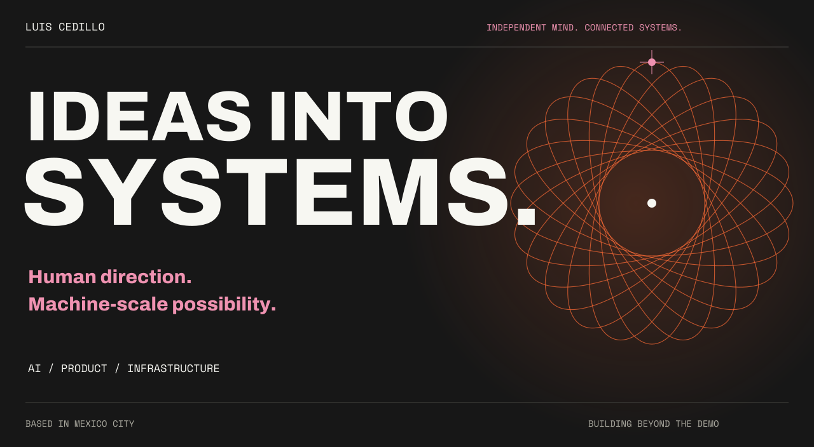
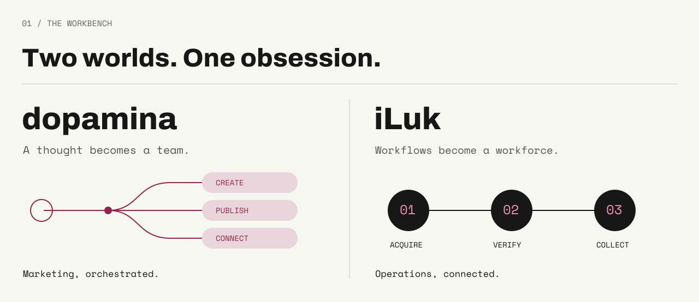
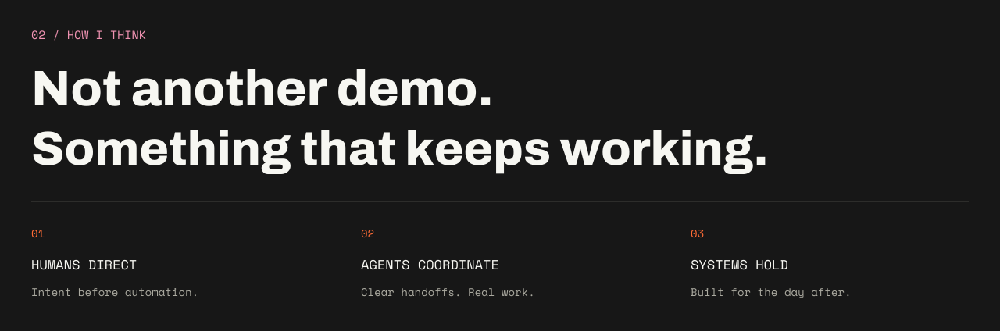

<a href="https://luiscedillo.com"></a>

<p align="center">
  <a href="https://luiscedillo.com">EXPLORE MY WORLD</a> &nbsp; / &nbsp;
  <a href="https://linkedin.com/in/luisced">LET’S CONNECT</a> &nbsp; / &nbsp;
  <a href="mailto:me@luiscedillo.com">START SOMETHING</a>
</p>





<a href="https://luiscedillo.com"></a>

<details>
<summary>Behind the scenes / coding activity</summary>

[WakaTime](https://wakatime.com/@c7405de5-ee2f-4399-b19b-e2a8e8fd5856)

<!--START_SECTION:waka-->

```rust
From: 16 February 2022 - To: 02 October 2026

Total Time: 2,439 hrs 30 mins

Python                     1,175 hrs 3 mins      >>>>>>>>>>>>-------------   46.91 %
TypeScript                 367 hrs 4 mins        >>>>---------------------   14.65 %
CSS                        106 hrs 10 mins       >------------------------   04.24 %
Bash                       99 hrs 9 mins         >------------------------   03.96 %
C#                         86 hrs 22 mins        >------------------------   03.45 %
JavaScript                 74 hrs 50 mins        >------------------------   02.99 %
C++                        66 hrs 44 mins        >------------------------   02.66 %
Other                      65 hrs 18 mins        >------------------------   02.61 %
```

<!--END_SECTION:waka-->

</details>
